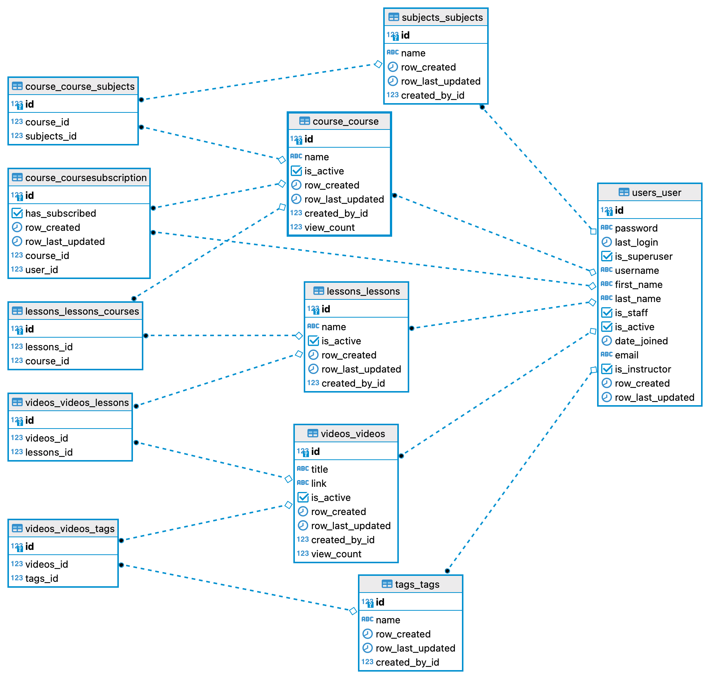

## Problem Statement
You need to build a Rest API where Instructors and Students can manage their Courses. An Instructor can manage Subjects, Courses, Tags, Lessons, and Videos. Below are the relationships between various entities.

- An Instructor is a User with a flag is_instructor = True.
- A Student is a User with is_instructor = False.
- A Course can belong to multiple Subjects.
- A Lesson can belong to multiple Courses.
- A Video can belong multiple Lessons.
- A Video can have multiple attached Tags.
-   A Video should have a link field to save YouTube or Vimeo url.

## User Stories
### Instructor

- [x] As logged in instructor, I can create, view, edit, delete Tags.

- [x] As logged in instructor, I can create, view, edit, delete Subjects.

- [x] As logged in instructor, I can create, view, edit, delete Courses.

- [x] As logged in instructor, I can create, view, edit, delete Lesson.

- [x] As logged in instructor, I can create, view, edit, delete Videos.

- [x] As logged in instructor, I can view analytics - most viewed Courses and Videos.

### Student

- [x] As a logged in student, I can view all active Courses. I can filter Courses by Subject.
- [x] As a logged in student, I can view all active Lessons for a selected Course.
- [x] As a logged in student, I can view all active Videos for a selected Lesson. Videos Can be filtered by Video title and Tag names.
- [x] As a logged in student, I can view the selected Video details.
- [x] As a logged in student, I can subscribe, unsubsribe to various Courses.

### Optional
- [x] Video details should have personalized Course recommendations.

## Tech Used
- Python 3.8
- Django 3.2.8
- PostgreSQL 14.0

## Steps to setup the project
- Clone the project
- Create a virtual environment 
- Go to the root of the cloned folder and run `pip install requirements.txt`
- Set the Environment variables given in the `.env` file
- Run `python manage.py migrate` to create the DB tables
- Run `python manage.py runserver` to run the server 

## Database design overview

## Important Links
- API Documentation => [Postman Public API documentation](https://documenter.getpostman.com/view/18172346/UVByLB82)

## Areas of Improvement
- Logging can be done using `ELK stack`, which would make searching and viewing the logs faster and better.
- Integration testing of the APIs.